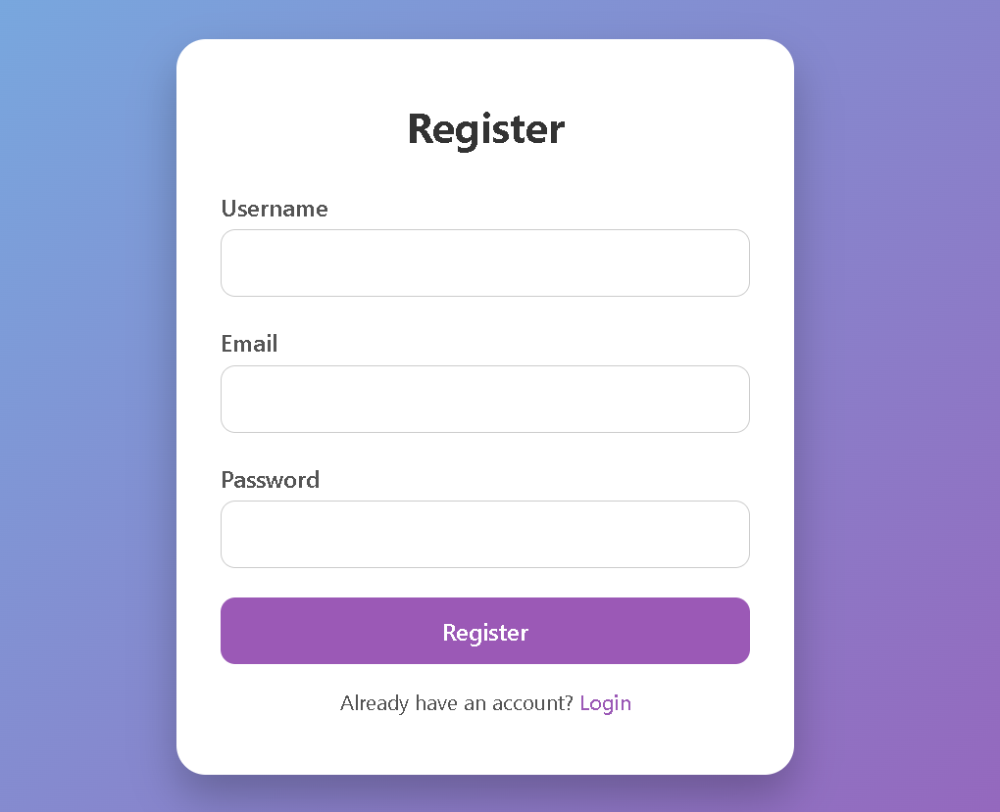
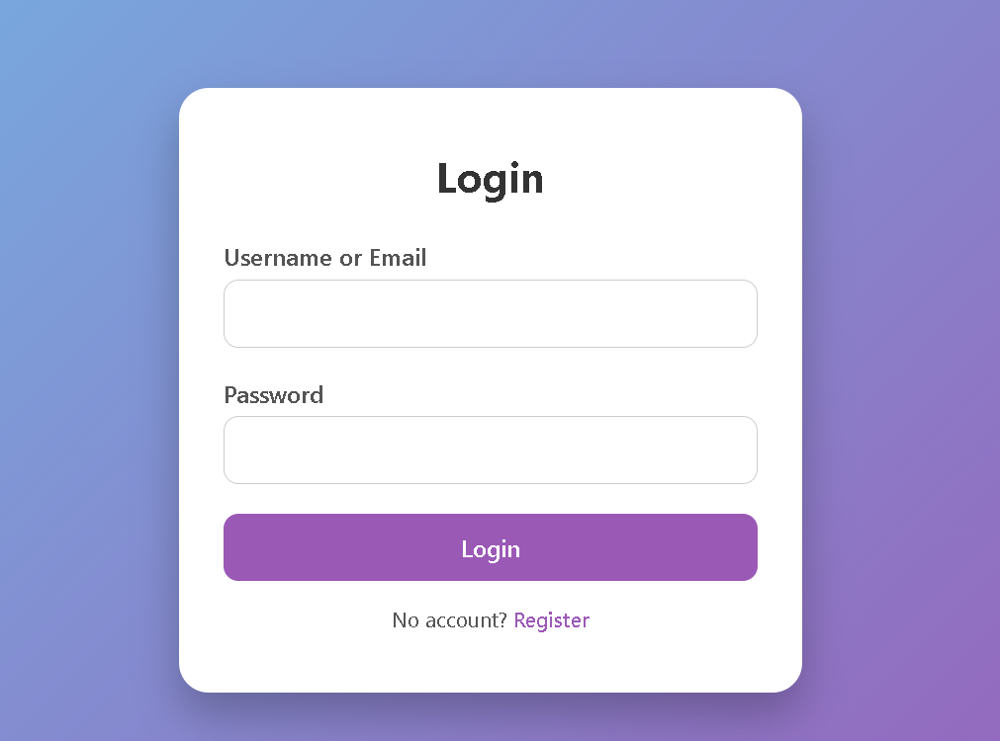
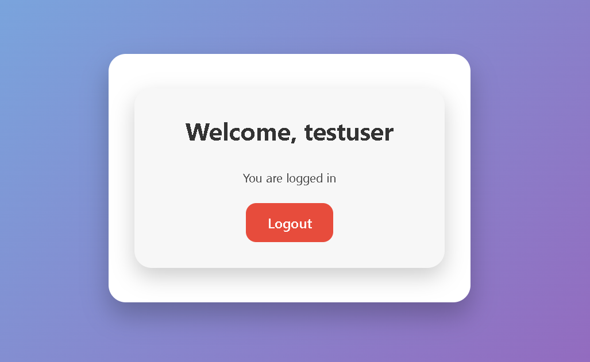

# User Registration and Login System (PHP + MySQL)

## Description
A simple, fully functional, **User Registration and Login System** built with PHP and MySQL. Users can register, log in, access a dashboard, and log out. The system uses **secure password hashing** and sessions for authentication.

## Features
- User registration with username, email, and password
- User login with username or email
- Dashboard accessible only to logged-in users
- Logout functionality
- Password hashing for security

## Requirements
- PHP 8+
- MySQL
- Web server (XAMPP recommended)

## Setup Instructions
1. Install [XAMPP](https://www.apachefriends.org/) or a PHP+MySQL server.
2. Start **Apache** and **MySQL** from XAMPP Control Panel.
3. Copy the project folder into XAMPP's `htdocs` folder:
   ```
   C:\xampp\htdocs\User-Registration-and-login-System--php---sql-\
   ```
4. Open phpMyAdmin ([http://localhost/phpmyadmin](http://localhost/phpmyadmin)).
5. Import `db.sql` to create the database and table.
6. Open the project in browser:
   ```
   http://localhost/User-Registration-and-login-System--php---sql-/
   ```
7. Register a new user and log in to access the dashboard.

## Screenshots






